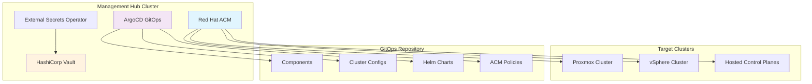

# Multi-Cluster OpenShift Management with GitOps

<div align="center">
  
  
</div>

<div align="center">
  <h3>Enterprise-grade multi-cluster OpenShift management using ArgoCD and GitOps principles</h3>

[](https://www.redhat.com/en/technologies/cloud-computing/openshift)
[](https://argo-cd.readthedocs.io/)
[](https://helm.sh/)
[](https://kustomize.io/)

</div>

---

## 📋 Table of Contents

- [Overview](#overview)
- [Architecture](#architecture)
- [Quick Start](#quick-start)
- [Repository Structure](#repository-structure)
- [Cluster Management](#cluster-management)
- [Components & Features](#components--features)
- [Development Environment](#development-environment)
- [ArgoCD Plugins](#argocd-plugins-and-usage)
- [Troubleshooting](#troubleshooting)
- [Contributing](#contributing)
- [Resources](#resources)

## 📖 Overview

This repository provides a production-ready, declarative approach to managing multiple OpenShift clusters using **GitOps principles** with ArgoCD. It enables:

✅ **Multi-cluster orchestration** with Red Hat Advanced Cluster Management (ACM)  
✅ **Consistent configuration** across development, staging, and production environments  
✅ **Automated deployments** and synchronization using ArgoCD  
✅ **Secure secret management** with External Secrets Operator and 1Password  
✅ **Infrastructure as Code** with Helm charts and Kustomize overlays  
✅ **Policy-based governance** and compliance automation

> 💡 This setup follows the [GitOps Standards Repository Template](https://github.com/redhat-cop/gitops-standards-repo-template) from Red Hat Communities of Practice.

## 🏗️ Architecture



### Key Components

- **🎯 ArgoCD**: Continuous deployment and GitOps orchestration
- **🌐 Red Hat ACM**: Multi-cluster management and governance
- **🔐 External Secrets**: Secure secret injection from external systems
- **📜 Cert Manager**: Automated TLS certificate management
- **🔧 Operators**: 50+ OpenShift operators for various capabilities
- **📊 Observability**: Integrated monitoring, logging, and alerting

## 🚀 Quick Start

### Prerequisites

| Tool                  | Version | Download Link                                                                                                                     | Purpose                                                     |
| --------------------- | ------- | --------------------------------------------------------------------------------------------------------------------------------- | ----------------------------------------------------------- |
| **OpenShift Cluster** | 4.12+   | -                                                                                                                                 | Target deployment environment with cluster-admin privileges |
| **oc CLI**            | Latest  | [Download](https://mirror.openshift.com/pub/openshift-v4/amd64/clients/ocp/latest/openshift-client-linux.tar.gz)                  | OpenShift command-line interface                            |
| **openshift-install** | Latest  | [Download](https://mirror.openshift.com/pub/openshift-v4/amd64/clients/ocp/latest/openshift-install-linux.tar.gz)                 | Cluster installation tool                                   |
| **Helm**              | 3.12+   | [Download](https://developers.redhat.com/content-gateway/file/pub/openshift-v4/clients/helm/3.12.1/helm-linux-amd64.tar.gz)       | Package manager for Kubernetes                              |
| **Kustomize**         | 5.3+    | [Download](https://github.com/kubernetes-sigs/kustomize/releases/download/kustomize%2Fv5.3.0/kustomize_v5.3.0_linux_amd64.tar.gz) | Configuration management tool                               |
| **Git Access**        | -       | -                                                                                                                                 | Repository access and credentials                           |

### System Requirements

- **CPU**: 4+ cores per control plane node
- **Memory**: 16GB+ RAM per control plane node
- **Storage**: 100GB+ available disk space
- **Network**: Stable internet connection for image pulls

### 1. Deploy OpenShift Cluster

**Step 1: Clone Repository**

```bash
# Clone the repository
git clone https://github.com/Vikaspogu/openshift-multicluster.git
cd openshift-multicluster
```

**Step 2: Configure Installation Files**

a. **Update `installer/proxmox/install-config.yaml`**:

- ✏️ Base Domain (e.g., `cluster.example.com`)
- 🌐 Machine Network CIDR (e.g., `192.168.1.0/24`)
- 📍 API and Ingress VIPs
- 🔑 Pull secret and SSH Key

b. **Update `installer/proxmox/agent-config.yaml`**:

- 📡 Rendezvous IP
- 🔧 MacAddress, IP, DNS, Interfaces and Hostname for all hosts

**Step 3: Generate Installation ISO**

```bash
./openshift-install agent create image --dir installer/proxmox
```

**Step 4: Deploy to Proxmox**

1. Upload the generated ISO to your Proxmox storage
2. Create VMs using the ISO image
3. Start all VMs to begin the installation process

**Step 5: Monitor Installation Progress**

```bash
# Wait for installation to complete
export KUBECONFIG=installer/proxmox/auth/kubeconfig
./openshift-install agent wait-for install-complete --dir installer/proxmox --log-level=debug
```

### 2. Bootstrap GitOps

**Update `repoURL` and `path` in the ArgoCD root application(App of Apps pattern) under `components/root-application/`**

**Update Repository URL**: Modify the cluster configuration in `clusters/<cluster-name>/kustomization.yaml`:

```yaml
helmCharts:
  - name: argocd-app-of-apps
    valuesInline:
      default:
        source:
          repoURL: https://github.com/YOUR-USERNAME/openshift-multicluster.git
          targetRevision: HEAD
        destination:
          server: https://kubernetes.default.svc
```

**Customize for Your Environment**:

- Replace `YOUR-USERNAME` with your GitHub username

```bash
# Step 1: Login to your OpenShift cluster
oc login --server=https://api.cluster.example.com:6443

# Step 2: Bootstrap ArgoCD and initial applications
oc apply -k components/root-application/

# Step 3: Wait for ArgoCD to be ready (may take 2-3 minutes)
oc wait --for=condition=available deployment/openshift-gitops-server -n openshift-gitops --timeout=300s

# Step 4: Verify ArgoCD deployment
oc get applications -n openshift-gitops

# Step 5: Get ArgoCD admin password (optional)
oc extract secret/openshift-gitops-cluster -n openshift-gitops --to=-
```

> ⚠️ **Note**: Initial sync may take 5-10 minutes as operators are installed and configured.

## 📁 Repository Structure

```text
openshift-multicluster/
├── apps/                    # Application-specific configurations
├── clusters/                # Cluster-specific configurations
│   ├── proxmox/            # Proxmox cluster configuration
│   └── vsphere/            # vSphere cluster configuration
├── components/             # Reusable component definitions
│   ├── operators/          # OpenShift operators
│   ├── configs/            # Configuration components
│   └── charts/             # Custom Helm charts
├── groups/                 # Common configurations by environment
│   ├── all/                # Applied to all clusters
│   └── dev/                # Development environment specific
├── helm/charts/            # Custom Helm charts
├── installer/              # Cluster installation files
└── scripts/                # Utility scripts
```

### Configuration Hierarchy

1. **Groups** (`groups/`) - Environment-wide defaults
2. **Clusters** (`clusters/`) - Cluster-specific overrides
3. **Components** (`components/`) - Individual service configurations
4. **Apps** (`apps/`) - Application deployments

## 🎛️ Cluster Management

### Supported Platforms

| Platform    | Status        | Features                            |
| ----------- | ------------- | ----------------------------------- |
| **Proxmox** | ✅ Production | VM management, storage integration  |
| **vSphere** | ✅ Production | vCenter integration, DRS/HA support |

### Adding a New Cluster

1. **Create cluster directory:**

   ```bash
   mkdir clusters/new-cluster
   cp clusters/proxmox/kustomization.yaml clusters/new-cluster/
   ```

2. **Customize configuration:**

   ```bash
   # Edit cluster-specific values
   vim clusters/new-cluster/kustomization.yaml
   ```

3. **Deploy via ArgoCD:**

   ```bash
   # ArgoCD will automatically detect and sync the new cluster
   oc get applications -n openshift-gitops
   ```

## 🧩 Components & Features

### 💭 Core Infrastructure

| Component               | Purpose                                                                  | Status        |
| ----------------------- | ------------------------------------------------------------------------ | ------------- |
| **🔄 OpenShift GitOps** | ArgoCD for continuous deployment and application lifecycle management    | ✅ Production |
| **🌐 Red Hat ACM**      | Multi-cluster management hub with governance and policy enforcement      | ✅ Production |
| **🔒 External Secrets** | Secure secret injection from external systems (1Password, Vault, AWS)    | ✅ Production |
| **📜 Cert Manager**     | Automated TLS certificate management via Let's Encrypt and DNS providers | ✅ Production |
| **🔧 Patch Operator**   | Dynamic cluster configuration updates and resource patching              | ✅ Production |

### 🛡️ Security & Compliance

| Component          | Purpose                                                         | Features                                                       |
| ------------------ | --------------------------------------------------------------- | -------------------------------------------------------------- |
| **🛡️ Red Hat ACS** | Advanced Cluster Security for container and Kubernetes security | Vulnerability scanning, policy enforcement, runtime protection |
| **🔐 LDAP Sync**   | Automated user and group synchronization                        | Active Directory integration, group mapping                    |
| **🔑 OAuth**       | External identity provider integration                          | LDAP, OIDC, GitHub, Google authentication                      |

### 💻 Developer Experience

| Component                  | Purpose                                        | Benefits                                            |
| -------------------------- | ---------------------------------------------- | --------------------------------------------------- |
| **🏗️ Developer Hub**       | Internal developer platform based on Backstage | Service catalog, documentation, templates           |
| **💻 Dev Spaces**          | Cloud-native development workspaces            | VS Code in browser, consistent dev environments     |
| **🚀 OpenShift Pipelines** | Tekton-based CI/CD with Pipeline-as-Code       | GitOps workflows, secure builds, multi-arch support |
| **🖥️ Web Terminal**        | Browser-based cluster access                   | No local tools needed, instant access               |

### 💾 Storage & Data Management

| Component             | Use Case                                       | Features                                      |
| --------------------- | ---------------------------------------------- | --------------------------------------------- |
| **💾 LVM Storage**    | Local volume management for persistent storage | Dynamic provisioning, snapshot support        |
| **📊 CloudNative-PG** | PostgreSQL operator for cloud-native databases | High availability, backup/restore, monitoring |
| **🔄 VolSync**        | Volume replication and backup solutions        | Cross-cluster replication, disaster recovery  |
| **🗄️ Synology CSI**   | Network-attached storage integration           | NFS/iSCSI support, snapshot capabilities      |

### 📈 Observability Stack

| Component                | Function                                 | Integration                           |
| ------------------------ | ---------------------------------------- | ------------------------------------- |
| **📊 Alertmanager**      | Alert routing, grouping, and management  | Slack, email, PagerDuty notifications |
| **📋 OpenShift Logging** | Centralized log aggregation and analysis | Elasticsearch, Fluentd, Kibana stack  |
| **🔍 Log Forwarder**     | External log shipping configuration      | Splunk, external Elasticsearch, S3    |

### 🌐 Networking & Connectivity

| Component          | Purpose                                      | Environment                          |
| ------------------ | -------------------------------------------- | ------------------------------------ |
| **⚖️ MetalLB**     | Load balancer for bare-metal clusters        | On-premises, edge deployments        |
| **🌐 NMState**     | Declarative network configuration management | Static IPs, bonding, VLANs           |
| **☁️ Cloudflared** | Secure tunnel management without VPN         | Remote access, zero-trust networking |

## 💻 Development Environment

### DevSpaces Setup

This repository includes a pre-configured development environment using OpenShift Dev Spaces:

```yaml
# devfile.yaml
components:
  - name: dev-tools
    container:
      image: quay.io/rhn_gps_vpogu/devspaces-fedora40-tooling:2.0.0
      memoryLimit: 4Gi
```

### Task Runner

Use the included Task runner for common operations:

```bash
# List all available tasks
task --list

# Example tasks (extend as needed)
task volsync:snapshot    # Create volume snapshots
task validate           # Validate YAML configurations
task test               # Run integration tests
```

## 🔌 ArgoCD Plugins and Usage

### ArgoCD Lovely Plugin

The [ArgoCD Lovely Plugin](https://github.com/crumbhole/argocd-lovely-plugin) enhances Kustomize capabilities:

- **Environment Variable Substitution**: Replace variables across multiple files
- **Dynamic Patching**: Apply patches based on cluster context
- **Channel Management**: Update operator channels dynamically

#### Examples

**Operator Channel Patching:**

```yaml
# clusters/proxmox/cert-manager.yaml
spec:
  source:
    plugin:
      parameters:
        - name: channel
          value: "stable-v1.13"
```

**Variable Replacement with sed:**

```yaml
parameters:
  - name: sed
    value: "s/CLUSTER_NAME/proxmox-cluster/g **/*.yaml"
```

**YAML Path Updates with yq:**

```yaml
parameters:
  - name: yq
    value: '.spec.domain = "apps.cluster.example.com" ingress.yaml'
```

### Custom Plugins

Additional plugins are configured in [`components/openshift-gitops-config/`](./components/openshift-gitops-config/).

---

<div align="center">
  <p>Made with ❤️ for the OpenShift community</p>
  <p>
    <a href="https://github.com/Vikaspogu/openshift-multicluster/issues">Report Bug</a> •
    <a href="https://github.com/Vikaspogu/openshift-multicluster/issues">Request Feature</a>
  </p>
</div>
