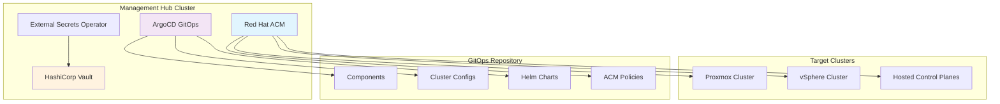

# Multi-Cluster OpenShift Management with GitOps

<div align="center">
  
  
</div>

<div align="center">
  <h3>Enterprise-grade multi-cluster OpenShift management using ArgoCD and GitOps principles</h3>

[](https://www.redhat.com/en/technologies/cloud-computing/openshift)
[](https://argo-cd.readthedocs.io/)
[](https://helm.sh/)
[](https://kustomize.io/)

</div>

---

## 📋 Table of Contents

- [Overview](#overview)
- [Architecture](#architecture)
- [Quick Start](#quick-start)
- [Repository Structure](#repository-structure)
- [Cluster Management](#cluster-management)
- [Components & Features](#components--features)
- [Development Environment](#development-environment)
- [ArgoCD Plugins](#argocd-plugins-and-usage)
- [Troubleshooting](#troubleshooting)
- [Contributing](#contributing)
- [Resources](#resources)

## 📖 Overview

This repository provides a production-ready, declarative approach to managing multiple OpenShift clusters using **GitOps principles** with ArgoCD. It enables:

- **Multi-cluster orchestration** with Red Hat Advanced Cluster Management (ACM)
- **Consistent configuration** across development, staging, and production environments
- **Automated deployments** and synchronization using ArgoCD
- **Secure secret management** with External Secrets Operator and 1Password
- **Infrastructure as Code** with Helm charts and Kustomize overlays
- **Policy-based governance** and compliance automation

This setup follows the [GitOps Standards Repository Template](https://github.com/redhat-cop/gitops-standards-repo-template) from Red Hat Communities of Practice.

## 🏗️ Architecture



### Key Components

- **🎯 ArgoCD**: Continuous deployment and GitOps orchestration
- **🌐 Red Hat ACM**: Multi-cluster management and governance
- **🔐 External Secrets**: Secure secret injection from external systems
- **📜 Cert Manager**: Automated TLS certificate management
- **🔧 Operators**: 50+ OpenShift operators for various capabilities
- **📊 Observability**: Integrated monitoring, logging, and alerting

## 🚀 Quick Start

### Prerequisites

- OpenShift cluster with cluster-admin privileges
- `oc` CLI tool installed and configured
- Git repository access and credentials

### 1. Deploy OpenShift Cluster

#### Option A: Agent-based Installer (Recommended)

```bash
# Clone the repository
git clone https://github.com/Vikaspogu/openshift-multicluster.git
cd openshift-multicluster

# Generate installation ISO
rm -rf installer/proxmox
cp -r installer/cluster installer/proxmox
./openshift-install agent create image --dir installer/proxmox

# Wait for installation to complete
export KUBECONFIG=installer/proxmox/auth/kubeconfig
./openshift-install agent wait-for install-complete --dir installer/proxmox --log-level=debug
```

#### Option B: Automated with Ansible

Use the [automated workflow](https://github.com/Vikaspogu/homelab-orchestrator/blob/main/ansible/awx/workflows/openshift-cluster.yaml) for hands-off deployment.

### 2. Bootstrap GitOps

```bash
# Login to your OpenShift cluster
oc login --server=https://api.cluster.example.com:6443

# Bootstrap ArgoCD and initial applications
oc apply -k components/root-application/

# Verify ArgoCD deployment
oc get applications -n openshift-gitops
```

### 3. Configure Cluster-Specific Settings

Update the cluster configuration in `clusters/<cluster-name>/kustomization.yaml` to match your environment:

```yaml
helmCharts:
  - name: argocd-app-of-app
    valuesInline:
      default:
        source:
          repoURL: https://github.com/YOUR-USERNAME/openshift-multicluster.git
```

## 📁 Repository Structure

```text
openshift-multicluster/
├── apps/                    # Application-specific configurations
├── clusters/                # Cluster-specific configurations
│   ├── proxmox/            # Proxmox cluster configuration
│   └── vsphere/            # vSphere cluster configuration
├── components/             # Reusable component definitions
│   ├── operators/          # OpenShift operators
│   ├── configs/            # Configuration components
│   └── charts/             # Custom Helm charts
├── groups/                 # Common configurations by environment
│   ├── all/                # Applied to all clusters
│   └── dev/                # Development environment specific
├── helm/charts/            # Custom Helm charts
├── installer/              # Cluster installation files
└── scripts/                # Utility scripts
```

### Configuration Hierarchy

1. **Groups** (`groups/`) - Environment-wide defaults
2. **Clusters** (`clusters/`) - Cluster-specific overrides
3. **Components** (`components/`) - Individual service configurations
4. **Apps** (`apps/`) - Application deployments

## 🎛️ Cluster Management

### Supported Platforms

| Platform                  | Status        | Features                            |
| ------------------------- | ------------- | ----------------------------------- |
| **Proxmox**               | ✅ Production | VM management, storage integration  |
| **vSphere**               | ✅ Production | vCenter integration, DRS/HA support |
| **Hosted Control Planes** | 🚧 Beta       | Cost-effective multi-tenancy        |

### Adding a New Cluster

1. **Create cluster directory:**

   ```bash
   mkdir clusters/new-cluster
   cp clusters/proxmox/kustomization.yaml clusters/new-cluster/
   ```

2. **Customize configuration:**

   ```bash
   # Edit cluster-specific values
   vim clusters/new-cluster/kustomization.yaml
   ```

3. **Deploy via ArgoCD:**

   ```bash
   # ArgoCD will automatically detect and sync the new cluster
   oc get applications -n openshift-gitops
   ```

## 🧩 Components & Features

### Core Infrastructure

- **🔄 OpenShift GitOps** - ArgoCD for continuous deployment
- **🌐 Red Hat ACM** - Multi-cluster management hub
- **🔒 External Secrets** - Secret management with 1Password/Vault integration
- **📜 Cert Manager** - Automated TLS certificates via Let's Encrypt/Cloudflare
- **🔧 Patch Operator** - Dynamic cluster configuration updates

### Security & Compliance

- **🛡️ Red Hat ACS** - Advanced Cluster Security for Kubernetes
- **📋 Kyverno** - Policy engine for security and best practices
- **🔐 LDAP Sync** - Automated user and group synchronization
- **🔑 OAuth** - External identity provider integration

### Developer Experience

- **🏗️ Red Hat Developer Hub** - Internal developer platform (Backstage)
- **💻 OpenShift Dev Spaces** - Cloud-native development workspaces
- **🚀 OpenShift Pipelines** - Tekton-based CI/CD with Pipeline-as-Code
- **🖥️ Web Terminal** - Browser-based cluster access

### Storage & Data

- **💾 LVM Storage** - Local volume management for persistent storage
- **📊 CloudNative-PG** - PostgreSQL operator for databases
- **🔄 VolSync** - Volume replication and backup
- **🗄️ Synology CSI** - Network-attached storage integration

### Observability

- **📊 Alertmanager** - Alert routing and management
- **📋 OpenShift Logging** - Centralized log aggregation
- **🔍 Log Forwarder** - External log shipping configuration

### Networking

- **⚖️ MetalLB** - Load balancer for bare-metal clusters
- **🌐 NMState** - Declarative network configuration
- **☁️ Cloudflared** - Secure tunnel management

## 💻 Development Environment

### DevSpaces Setup

This repository includes a pre-configured development environment using OpenShift Dev Spaces:

```yaml
# devfile.yaml
components:
  - name: dev-tools
    container:
      image: quay.io/rhn_gps_vpogu/devspaces-fedora40-tooling:2.0.0
      memoryLimit: 4Gi
```

### Task Runner

Use the included Task runner for common operations:

```bash
# List all available tasks
task --list

# Example tasks (extend as needed)
task volsync:snapshot    # Create volume snapshots
task validate           # Validate YAML configurations
task test               # Run integration tests
```

## 🔌 ArgoCD Plugins and Usage

### ArgoCD Lovely Plugin

The [ArgoCD Lovely Plugin](https://github.com/crumbhole/argocd-lovely-plugin) enhances Kustomize capabilities:

- **Environment Variable Substitution**: Replace variables across multiple files
- **Dynamic Patching**: Apply patches based on cluster context
- **Channel Management**: Update operator channels dynamically

#### Examples

**Operator Channel Patching:**

```yaml
# clusters/proxmox/cert-manager.yaml
spec:
  source:
    plugin:
      parameters:
        - name: channel
          value: "stable-v1.13"
```

**Variable Replacement with sed:**

```yaml
parameters:
  - name: sed
    value: "s/CLUSTER_NAME/proxmox-cluster/g **/*.yaml"
```

**YAML Path Updates with yq:**

```yaml
parameters:
  - name: yq
    value: '.spec.domain = "apps.cluster.example.com" ingress.yaml'
```

### Custom Plugins

Additional plugins are configured in [`components/openshift-gitops-config/`](./components/openshift-gitops-config/).

## 🚨 Troubleshooting

### Common Issues

**ArgoCD Application Sync Failures:**

```bash
# Check application status
oc get applications -n openshift-gitops

# View detailed sync status
oc describe application <app-name> -n openshift-gitops

# Force sync
argocd app sync <app-name> --force
```

**External Secrets Not Syncing:**

```bash
# Check External Secrets operator logs
oc logs deployment/external-secrets -n external-secrets-operator

# Verify ClusterSecretStore connectivity
oc get clustersecretstore vault-backend -o yaml
```

**Cert Manager Certificate Issues:**

```bash
# Check certificate status
oc get certificates -A

# Review cert-manager logs
oc logs deployment/cert-manager -n cert-manager
```

### Validation

```bash
# Validate all YAML files
find . -name "*.yaml" -exec yamllint {} \;

# Check Kubernetes resource validity
scripts/kubeconform.sh
```

## 🤝 Contributing

1. Fork the repository
2. Create a feature branch (`git checkout -b feature/amazing-feature`)
3. Commit your changes (`git commit -m 'Add amazing feature'`)
4. Push to the branch (`git push origin feature/amazing-feature`)
5. Open a Pull Request

### Development Guidelines

- Follow the established directory structure
- Use meaningful commit messages
- Update documentation for new features
- Test changes in a development cluster first
- Ensure all YAML files pass validation

## 📚 Resources

### Documentation

- [OpenShift Documentation](https://docs.openshift.com/)
- [ArgoCD Documentation](https://argo-cd.readthedocs.io/)
- [Red Hat ACM Documentation](https://access.redhat.com/documentation/en-us/red_hat_advanced_cluster_management_for_kubernetes/)

### Community Resources

- [GitOps Catalog by Red Hat COP](https://github.com/redhat-cop/gitops-catalog)
- [GitOps Standards Template](https://github.com/redhat-cop/gitops-standards-repo-template)
- [OpenShift GitOps Examples](https://github.com/redhat-developer/openshift-gitops-examples)

### Related Projects

- [Homelab Orchestrator](https://github.com/Vikaspogu/homelab-orchestrator) - Ansible automation for infrastructure

---

<div align="center">
  <p>Made with ❤️ for the OpenShift community</p>
  <p>
    <a href="https://github.com/Vikaspogu/openshift-multicluster/issues">Report Bug</a> •
    <a href="https://github.com/Vikaspogu/openshift-multicluster/issues">Request Feature</a>
  </p>
</div>
