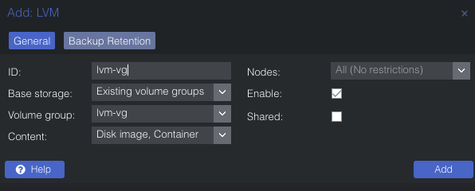

# OpenShift on Proxmox

Tools used:

- [Ansible](https://www.ansible.com/)
- [Terraform](https://www.terraform.io/)
- [Proxmox](https://www.proxmox.com/en/)

## Provisioning Proxmox instance

Installing proxmox is straightforward. Download boot ISO, flash to a USB, and complete the setup via GUI.

## Additional LVM Storage

Once proxmox is installed, add additional storage choose `Datacenter` > `Storage` > `Add` > `LVM`



## Configure Proxmox

[Configuring proxmox](../provision/ansible/playbooks/proxmox-prepare.yml) using Ansible

Playbook does following:

- Install's dark theme
- Provision's terraform role, user, and access control
- Create's ubuntu cloud-init template for VMs
- Enable's correct proxmox repositories
- Disable's subscription nag

```bash
task ansible:prepare-proxmox
```

## Baremetal OpenShift installation

[Install Playbook](../provision/ansible/playbooks/ocp4-install.yml) does following:

```bash
task ansible:ocp4-install
```

For my setup I am using a Ubuntu VM provisioned by [Terraform](../provision/terraform/proxmox/10-vm/) and Ansible [role](../provision/ansible/roles/ocp4/) to configure Load balancer, NFS and PXE boot services. DNS is configured on Synology NAS.

For some reason I ran into issue while trying to create RHCOS VM's using Terraform, so i switched to `qm` commands to create, stop bootstrap, master, and worker VMs.

```bash
qm create ....
qm start <vm-id>
```

Once the VM's are provisioned, playbook with start the OpenShift installer process. wait for ControlPlane and MC to be active.

Lastly, It will wait for the bootstrap process to complete and approve any pending CSRs.

At this point, I have a running OpenShift cluster.

## Post Install

Next, I will use ansible to create critical config resources using [Post install Playbook](../provision/ansible/playbooks/ocp4-post-install.yml) so ArgoCD can watch changes to my cluster folder.

```bash
task ansible:ocp4-post-install
```

- Install cert-manager, openshift-gitops operator
- Update ArgoCD instance with ingress and KSOPS plugin

## ArgoCD

- Configure Oauth provider
- Configure cert-manager cluster-issuer object
- Create certificate's for APIServer and Ingress. Update certificates as postsync hook job

## k3s node

- [Terraform](../provision/terraform/proxmox/00-vm) to create a VM based on ubuntu template for k3s node

```bash
task terraform:proxmox-apply DIR=provision/terraform/proxmox/00-vm
```

## Resources

- [Eth issue](https://forum.proxmox.com/threads/e1000e-unexpected-adapter-resets.89459/)
- [Proxmox helper scripts](https://tteck.github.io/Proxmox/)
- [Proxmox OCP playbooks](https://github.com/Keyvan-rh/Proxmox-OCP-Installer)
- [GitOps Catalog by RedHat COP](https://github.com/redhat-cop/gitops-catalog)
